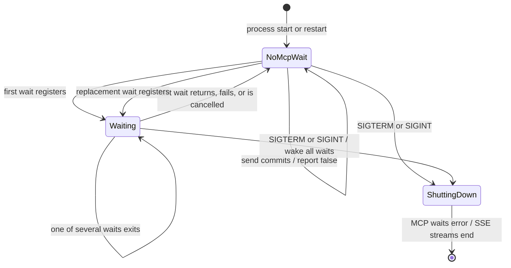
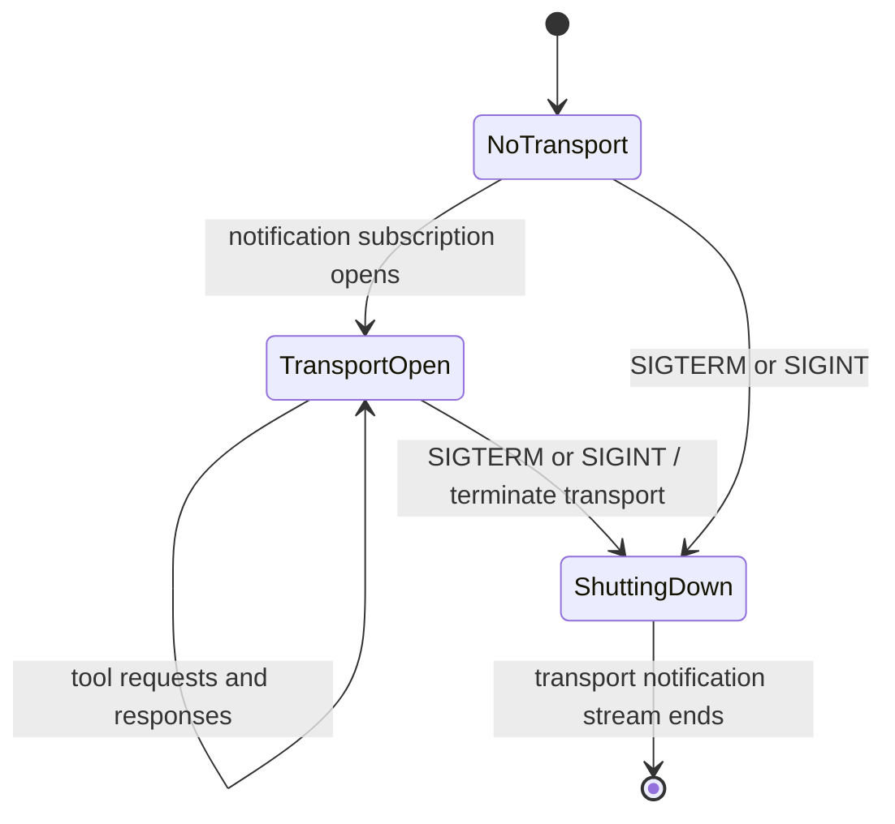

# Listener observation design

Implementers must treat `recipient_waiting_at_send` as a point-in-time
observation, not a delivery receipt. The durable message remains authoritative;
the observation only decides whether a local handoff should attempt a tmux wake
notice.

The required behavior is defined in [Agent Relay requirements](../requirements.md#delivery-and-wake-up-boundary).

## Behavioral acceptance list

- A send or reply commits its complete message before observing or notifying a
  recipient listener.
- A recipient with no active MCP wait produces
  `recipient_waiting_at_send = false` without changing message durability.
- A recipient with one or more active MCP waits produces
  `recipient_waiting_at_send = true` and wakes every active wait.
- A wait is observable before its first durable inbox check. A message already
  pending when the wait starts is therefore returned without leaving a stale
  active-wait observation.
- A wait that returns, fails, or is cancelled ceases to be observable even when
  cleanup races with a send.
- A process restart clears all listener observations and preserves every
  unacknowledged message.
- Concurrent waits may receive the same unacknowledged message. The observation
  does not turn notification into an exclusive queue claim.
- Server-Sent Event connections do not affect the MCP-wait observation.
- `SIGTERM` or `SIGINT` enters shutdown before the web server waits for open
  connections, wakes every MCP wait, `/v1/events` SSE stream, and MCP
  transport-owned notification stream, and changes no durable message state.
- A false observation may trigger a tmux wake notice, but the notice never
  contains or replaces the actionable Relay payload.

## State machine

The listener state belongs to one recipient session and exists only in the
running Relay process.



An MCP notification subscription has a separate transport state. The legacy
protocol carries it on a standalone GET; the modern protocol carries it on a
`subscriptions/listen` POST. Neither affects listener observation, but shutdown
closes every active subscription before Uvicorn drains HTTP connections:



Message storage is an independent durable state. Neither a listener transition
nor a process restart removes a message; only recipient acknowledgement does.

## Ordering rule

The in-process notification hub owns both the wake event and an active MCP-wait
count for each relay session. Wait registration, wait removal, observation, and
notification use the same asynchronous lock.

A send or reply follows this order:

1. Commit the message to SQLite.
2. Under the notification-hub lock, observe whether the recipient's active
   MCP-wait count is nonzero and set the recipient wake event.
3. Return the durable message fields plus the captured observation.

The field is named `recipient_waiting_at_send` because callers decide wake
behavior from a send result. Its documented instant is the notification step,
after the durable commit. A wait that registers between the commit and that
step legitimately changes the result to `true`.

## Interference matrix

Each cell names the guard between a state writer and work already in flight.

| State writer | Send or reply observing a recipient | MCP wait or listener stream checking the durable inbox | Handoff deciding whether to wake |
| --- | --- | --- | --- |
| Wait registers | Shared hub lock orders registration before or after observation. | Registration happens before the first inbox check. | The captured send result is immutable. |
| Send or reply commits and notifies | SQLite commits before the hub observation and event set. | Inbox check plus event semantics prevent a commit from being missed. | The returned boolean and message ID come from the same send operation. |
| Wait returns, fails, or is cancelled | `finally` removes the wait under the shared hub lock. | Durable messages remain unacknowledged until recipient processing. | A later send observes the updated count; an earlier result is not reinterpreted. |
| Recipient acknowledges | Acknowledgement does not mutate listener state. | Concurrent waits may already hold the same unacknowledged payload. | Wake notices refer to Relay IDs and never become message payloads. |
| Process enters shutdown | Notification reports false after shutdown begins. | Every event is set; MCP waits error, `/v1/events` streams end, and MCP transport notification subscriptions close without changing message state. | A missing send result remains ambiguous; a returned false result remains authoritative. |
| Relay process restarts | In-memory counts reset; the next send observes no wait. | SQLite replays every unacknowledged message to a replacement wait. | A false result permits recovery without claiming message loss. |

## Toy protocol model

Run the deterministic model from the repository root:

```bash
python docs/designs/listener_observation_simulator.py
```

The model covers send-before-wait, an active wait, cancellation, concurrent
waits, restart, the client-deadline replacement gap, and signal-driven
shutdown of both application and MCP transport streams. All scenarios must
finish with their expected observation and durable inbox contents.

## Test-double fidelity review

The toy model has properties production does not: explicit event order,
deterministic execution, zero I/O latency, and failure-free storage. It cannot
validate asyncio cancellation timing, Model Context Protocol transport
disconnects, operating-system signal delivery, SQLite failures, or process
death between commit and response. It also models MCP transport termination as
a state change; only a live test against the pinned MCP SDK can prove that its
legacy GET and modern `subscriptions/listen` POST release their Uvicorn
connections.

The in-process HTTP and MCP tests also run faster and more deterministically
than separate clients. They must force scheduling boundaries around wait
registration and cancellation instead of relying on elapsed time. Correctness
must come from the shared hub lock, `finally` cleanup, and SQLite durability;
neither implementation nor tests may depend on a task running promptly.

An ambiguous transport failure after commit remains intentionally unresolved:
the caller may not receive `recipient_waiting_at_send`, even though the message
is durable. Existing guidance against blind resend applies, and no tmux payload
fallback is inferred from the missing result.
